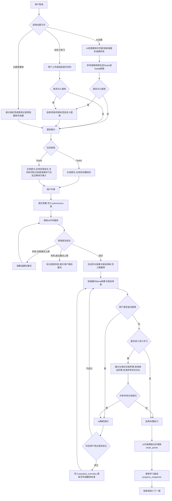
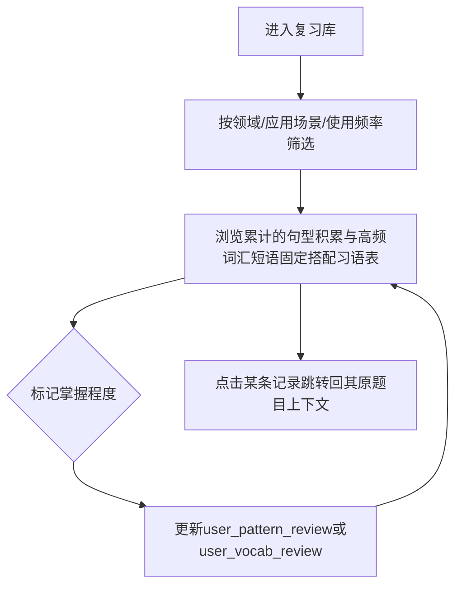
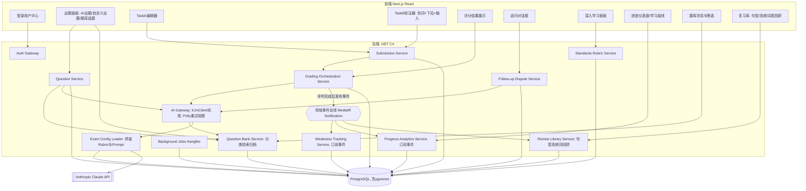
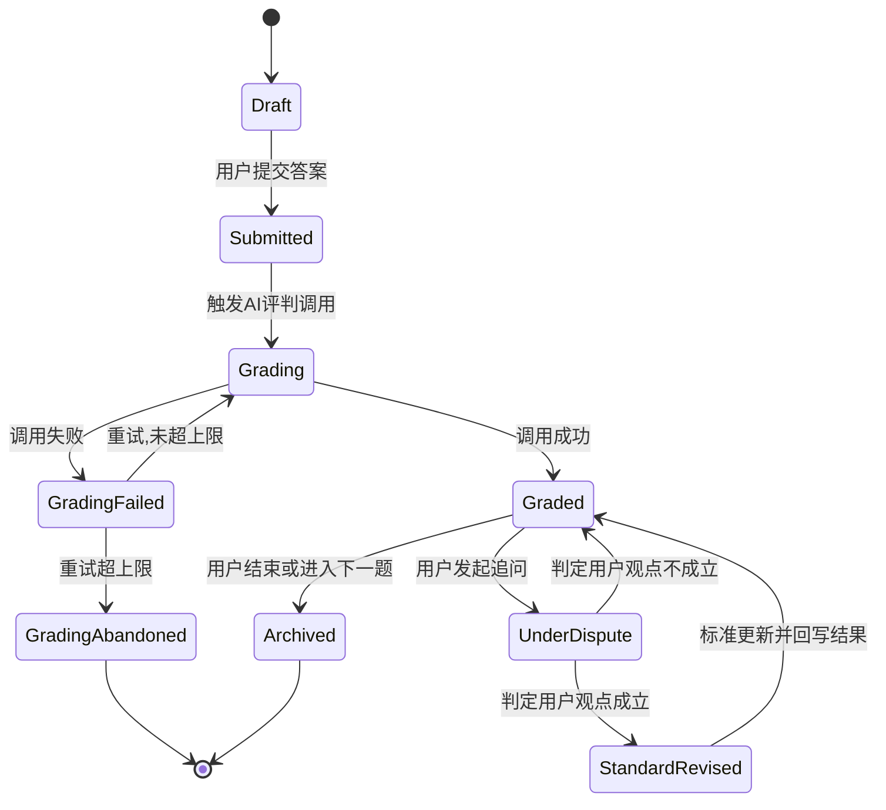
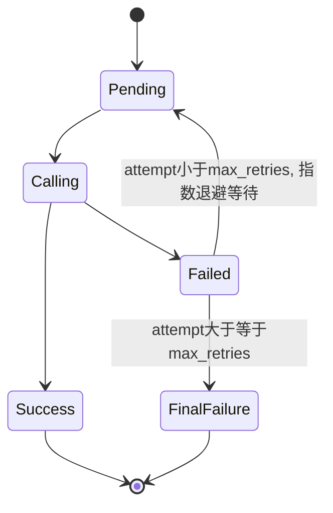
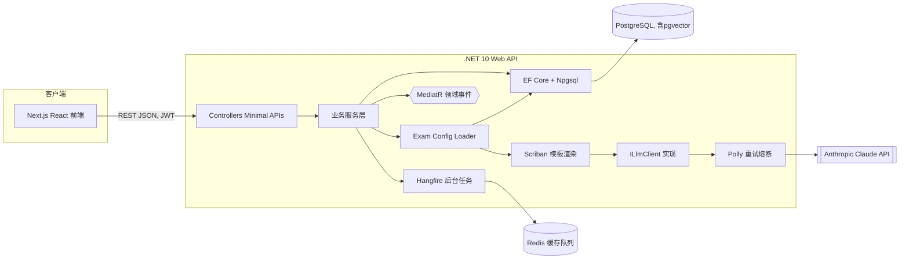
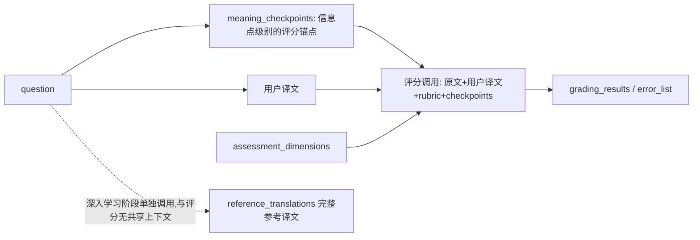

# NAATI CT 翻译练习辅助软件 —— 设计文档

技术栈:前端 Next.js / React,后端 .NET 10(C#,含AI调用逻辑,直连 Claude API,不再单独设Python服务),数据库 PostgreSQL。

---

## 一、功能与原提示词对照(概览)

| # | 功能 | 与原提示词关系 |
|---|---|---|
| 1 | AI出题 + 用户自定义出题 | 部分覆盖:AI出题规则、"自定义素材同等严格评估"已有;"自主出题"交互为新增 |
| 2 | TaskA/TaskB作答界面(划词标注) | 未覆盖,纯UI需求 |
| 3 | 提交→AI评判→错误清单→追问→**持久化修正标准** | 错误清单格式已覆盖;"持久化写入规则库影响后续评判"为新增工程能力 |
| 4 | 深入学习(长难句/表达积累/参考译文对比)+**持久化修正翻译标准** | 高度覆盖;持久化机制为新增 |
| 5 | 薄弱点自动分类追踪 | 提示词有静态清单,软件需做成动态检测 |
| 6 | 学习曲线分析 | 纯新增 |
| 7 | 数据存储 + AI调用重试机制 | 纯新增,系统工程需求 |

---

## 二、业务流程图

### 2.1 主练习流程(含题库联动)

### 2.2 复习库浏览流程(跨题目回顾句型/高频词表)

---

## 三、系统模块图

说明:`BE4`(Grading Orchestration Service)评判完成后不再直接调用薄弱点/进度/知识点抽取,而是发布一个`SubmissionGradedEvent`到领域事件总线,`BE7`/`BE8`/`BE12`各自订阅处理自己的逻辑。新增下游功能只需要新增一个订阅者,不需要回头修改`BE4`。

---

## 四、状态机图

### 4.1 提交/评判生命周期

### 4.2 AI调用重试子状态机(供AI相关调用复用)

> `StandardRevised`触发的并非立即生效的规则变更,而是新插入一条`status='observing'`的`standard_overrides`记录;真正影响后续评判需要经过第十节描述的观察期校准流程后才转为`active`。

---

## 五、系统架构图

说明:不再单独部署Python AI微服务,`ILlmClient`直接在.NET后端内通过`HttpClient`+`Polly`调用Claude;`Exam Config Loader`同进程内用EF Core读取`assessment_dimensions`/`error_taxonomies`/`prompt_templates`,交给`Scriban`拼装最终提示词后再调用`ILlmClient`。少一次跨进程/跨语言的网络跳转,重试也只需要一层。

---

## 六、数据库设计

统一约定:主键均为 `UUID`,时间字段均为 `TIMESTAMPTZ`,枚举建议用 PostgreSQL `ENUM` 或 `VARCHAR` + 应用层校验。

### 6.1 users 用户表
| 字段 | 类型 | 说明 |
|---|---|---|
| id | UUID (PK) | |
| username | VARCHAR(50) UNIQUE | |
| email | VARCHAR(255) UNIQUE | |
| password_hash | VARCHAR(255) | |
| display_name | VARCHAR(100) | |
| created_at | TIMESTAMPTZ | |
| last_login_at | TIMESTAMPTZ | |

### 6.2 questions 题目表
| 字段 | 类型 | 说明 |
|---|---|---|
| id | UUID (PK) | |
| task_type | ENUM('A','B') | |
| difficulty | ENUM('easy','medium','hard') | |
| title | VARCHAR(255) | |
| brief | JSONB | 领域/文本类型/目的/受众 |
| source_text | TEXT | 原文 |
| flawed_translation_text | TEXT NULL | 仅TaskB:含错译文全文 |
| word_count | INT | |
| origin | ENUM('ai_generated','user_uploaded','real_exam_seed') | real_exam_seed:预置真题样本 |
| source_type | ENUM('real_exam','ai_generated','user_generated') | 题库来源标记 |
| is_seed_reference | BOOLEAN | 是否标记为可供AI few-shot检索学习的真题样本 |
| in_bank | BOOLEAN | 是否已归档进题库(而非仅本次会话临时使用) |
| visibility | ENUM('private','shared') | private仅创建者可重练,shared进入公共题库 |
| created_by | UUID (FK users, NULL=系统生成) | |
| created_at | TIMESTAMPTZ | |
| is_active | BOOLEAN | |

### 6.3 task_b_seeded_errors TaskB预设错误表
| 字段 | 类型 | 说明 |
|---|---|---|
| id | UUID (PK) | |
| question_id | UUID (FK questions) | |
| position_start / position_end | INT | 在flawed_translation_text中的字符偏移 |
| error_category | ENUM(8类错误) | |
| correct_reference_text | TEXT | 正确译法 |
| note | TEXT | |
| created_at | TIMESTAMPTZ | |

### 6.4 submissions 提交表
| 字段 | 类型 | 说明 |
|---|---|---|
| id | UUID (PK) | |
| question_id | UUID (FK questions) | |
| user_id | UUID (FK users) | |
| task_type | ENUM('A','B') | |
| content | JSONB | TaskA:译文文本;TaskB:标注数组[{position,error_category,corrected_text}] |
| status | ENUM(状态机见第四节) | |
| submitted_at | TIMESTAMPTZ | |
| created_at / updated_at | TIMESTAMPTZ | |

### 6.5 grading_results 评分结果表
| 字段 | 类型 | 说明 |
|---|---|---|
| id | UUID (PK) | |
| submission_id | UUID (FK submissions) | |
| dimension | VARCHAR(50) | meaning_transfer / textual_norms / language_proficiency / revision_skills / error_categorisation |
| rubric_version | VARCHAR(20) | 本次评判依据的`assessment_dimensions.rubric_version`,用于事后追溯 |
| band | INT(1-5) | |
| pass_bool | BOOLEAN | |
| rationale | TEXT | 引用官方Band英文描述作为依据 |
| cumulative_density_flag | BOOLEAN | 累积密度是否构成独立降级风险 |
| cumulative_density_note | TEXT | |
| estimated_pass_probability | NUMERIC(5,2) | 主观估算 |
| created_at | TIMESTAMPTZ | |

### 6.6 error_list 错误清单表
| 字段 | 类型 | 说明 |
|---|---|---|
| id | UUID (PK) | |
| submission_id | UUID (FK submissions) | |
| position_ref | VARCHAR(100) | 定位信息 |
| source_text_snippet | TEXT | |
| user_text_snippet | TEXT | |
| error_category | ENUM(8类错误) | |
| dimension | VARCHAR(50) | |
| impacts_core | BOOLEAN | 是否影响核心信息/理解 |
| explanation | TEXT | |
| suggestion | TEXT | |
| created_at | TIMESTAMPTZ | |

### 6.7 follow_up_questions 追问表
| 字段 | 类型 | 说明 |
|---|---|---|
| id | UUID (PK) | |
| submission_id | UUID (FK submissions) | |
| user_id | UUID (FK users) | |
| context_ref | VARCHAR(100) | 关联的grading_result/error_list/reference_translation id |
| question_text | TEXT | |
| ai_response | TEXT | |
| verdict | ENUM('user_correct','user_incorrect','partial','pending') | |
| created_at | TIMESTAMPTZ | |

### 6.8 standard_overrides 标准修正记录表(核心新增,只增不改,形成审计链)
| 字段 | 类型 | 说明 |
|---|---|---|
| id | UUID (PK) | |
| scope | ENUM('grading_rubric','translation_reference') | |
| dimension_or_rule | VARCHAR(100) | |
| original_rule_text | TEXT | |
| revised_rule_text | TEXT | |
| triggered_by_followup_id | UUID (FK follow_up_questions) | |
| status | ENUM('observing','active','deprecated') | 新修正先进observing,经第十节校准流程确认后才转active |
| previous_override_id | UUID (FK self, NULL可) | 指向被取代的上一版本,形成完整历史链而非原地覆盖 |
| effective_from | TIMESTAMPTZ | |
| created_at | TIMESTAMPTZ | |

### 6.9 reference_translations 参考译文表
| 字段 | 类型 | 说明 |
|---|---|---|
| id | UUID (PK) | |
| question_id | UUID (FK questions) | |
| reference_text | TEXT | |
| comparison_notes | JSONB | 与用户译文的对比说明 |
| created_at | TIMESTAMPTZ | |

### 6.10 sentence_patterns 长难句句型积累表
| 字段 | 类型 | 说明 |
|---|---|---|
| id | UUID (PK) | |
| question_id | UUID (FK questions, NULL可) | |
| pattern_name | VARCHAR(100) | |
| example_sentence | TEXT | |
| breakdown_steps | JSONB | 主干/从句/同位语/插入语拆解步骤 |
| variants | TEXT | |
| domain | VARCHAR(50) | 领域分类,如法律/医疗/政府公告 |
| scenario | VARCHAR(100) | 应用场景,如移民信件/政策解读 |
| frequency_tag | VARCHAR(20) | 使用频率标签,如高频/中频/低频 |
| created_at | TIMESTAMPTZ | |

### 6.11 vocab_expressions 常用表达积累表
| 字段 | 类型 | 说明 |
|---|---|---|
| id | UUID (PK) | |
| question_id | UUID (FK questions, NULL可) | |
| english_expr | VARCHAR(255) | |
| chinese_equiv | VARCHAR(255) | |
| context_note | TEXT | 词典本义/引申义/语境义区分 |
| category | VARCHAR(50) | |
| domain | VARCHAR(50) | 领域分类,如法律/医疗/政府公告 |
| scenario | VARCHAR(100) | 应用场景,如移民信件/政策解读 |
| frequency_tag | VARCHAR(20) | 使用频率标签,如高频/中频/低频 |
| created_at | TIMESTAMPTZ | |

### 6.12 weak_points 薄弱点表
| 字段 | 类型 | 说明 |
|---|---|---|
| id | UUID (PK) | |
| user_id | UUID (FK users) | |
| category | VARCHAR(100) | |
| description | TEXT | |
| first_detected_at | TIMESTAMPTZ | |
| last_seen_at | TIMESTAMPTZ | |
| recurrence_count | INT | |
| status | ENUM('active','resolved') | |
| priority | ENUM('high','medium','low') | |

### 6.13 weak_point_occurrences 薄弱点关联记录表
| 字段 | 类型 | 说明 |
|---|---|---|
| id | UUID (PK) | |
| weak_point_id | UUID (FK weak_points) | |
| submission_id | UUID (FK submissions) | |
| error_list_id | UUID (FK error_list, NULL可) | |
| is_recurrence | BOOLEAN | 该薄弱点曾被标记resolved后又出现,标记为复发而非首次 |
| created_at | TIMESTAMPTZ | |

### 6.14 progress_snapshots 学习曲线快照表
| 字段 | 类型 | 说明 |
|---|---|---|
| id | UUID (PK) | |
| user_id | UUID (FK users) | |
| period_start / period_end | DATE | |
| difficulty_tier | VARCHAR(20) | |
| avg_band_meaning_transfer | NUMERIC(3,1) | |
| avg_band_textual_norms | NUMERIC(3,1) | |
| avg_band_language_proficiency | NUMERIC(3,1) | |
| pass_rate | NUMERIC(5,2) | |
| trend_note | TEXT | |
| key_turning_point | BOOLEAN | AI判定的关键学习节点 |
| created_at | TIMESTAMPTZ | |

### 6.15 ai_call_logs AI调用日志表
| 字段 | 类型 | 说明 |
|---|---|---|
| id | UUID (PK) | |
| request_type | ENUM('question_gen','grading','followup','standard_revision') | |
| related_id | UUID | 关联的submission/question等id |
| status | ENUM('pending','calling','success','failed','final_failure') | |
| attempt_count | INT | |
| max_retries | INT | |
| last_error_message | TEXT | |
| latency_ms | INT | |
| created_at / resolved_at | TIMESTAMPTZ | |

### 6.16 question_bank_categories 题库分类体系表
| 字段 | 类型 | 说明 |
|---|---|---|
| id | UUID (PK) | |
| category_type | ENUM('domain','scenario') | 领域或应用场景两套分类体系 |
| name | VARCHAR(100) | 如法律/医疗/政府公告;或"移民信件""政策解读" |
| parent_id | UUID (FK self, NULL可) | 支持层级分类 |
| description | TEXT | |
| created_at | TIMESTAMPTZ | |

### 6.17 question_category_map 题目分类映射表
| 字段 | 类型 | 说明 |
|---|---|---|
| id | UUID (PK) | |
| question_id | UUID (FK questions) | |
| category_id | UUID (FK question_bank_categories) | |

一道题可同时打上多个领域/场景标签,多对多关系。

### 6.18 seed_reference_links 真题参考溯源表
| 字段 | 类型 | 说明 |
|---|---|---|
| id | UUID (PK) | |
| generated_question_id | UUID (FK questions) | AI生成的新题 |
| seed_question_id | UUID (FK questions, is_seed_reference=true) | 被参考的真题样本 |
| similarity_reason | TEXT | 检索依据说明,如同领域+同难度+相似句式 |
| created_at | TIMESTAMPTZ | |

用于追溯"这道AI出的题参考了哪几篇真题的规律",便于审查出题质量与调优检索策略。

### 6.19 user_pattern_review 用户句型复习进度表
| 字段 | 类型 | 说明 |
|---|---|---|
| id | UUID (PK) | |
| user_id | UUID (FK users) | |
| pattern_id | UUID (FK sentence_patterns) | |
| times_encountered | INT | 累计遇到次数 |
| mastery_level | ENUM('new','familiar','mastered') | |
| last_reviewed_at | TIMESTAMPTZ | |
| created_at | TIMESTAMPTZ | |

### 6.20 user_vocab_review 用户高频词复习进度表
| 字段 | 类型 | 说明 |
|---|---|---|
| id | UUID (PK) | |
| user_id | UUID (FK users) | |
| vocab_id | UUID (FK vocab_expressions) | |
| times_encountered | INT | |
| mastery_level | ENUM('new','familiar','mastered') | |
| last_reviewed_at | TIMESTAMPTZ | |
| created_at | TIMESTAMPTZ | |

### 6.21 exam_types 考试类型/学科定义表
> 原第九节设计的"未来骨架表",现调整为MVP阶段就应实现——Rubric文本本来就要落在某个地方,写数据库和写Python字符串的初始成本一样,但只有前者能在不改代码的情况下切换考试类型。

| 字段 | 类型 | 说明 |
|---|---|---|
| id | UUID (PK) | |
| code | VARCHAR(50) UNIQUE | 如naati_ct_en_zh(MVP阶段只有这一行数据) |
| name | VARCHAR(100) | 如"NAATI CT 英译中" |
| subject_category | ENUM('translation','language_arts','math','science','other') | |
| source_language | VARCHAR(20) NULL | |
| target_language | VARCHAR(20) NULL | |
| grade_level | VARCHAR(50) NULL | |
| description | TEXT | |
| is_active | BOOLEAN | |
| created_at | TIMESTAMPTZ | |

### 6.22 assessment_dimensions 评分维度配置表(存官方Band英文原文,支持版本化与溯源)
| 字段 | 类型 | 说明 |
|---|---|---|
| id | UUID (PK) | |
| exam_type_id | UUID (FK exam_types) | |
| dimension_key | VARCHAR(50) | 如meaning_transfer |
| dimension_name | VARCHAR(100) | |
| scale_type | ENUM('band_1_5','score_0_100','rubric_level') | |
| pass_threshold | VARCHAR(20) | 如"Band 2 or above" |
| level_descriptions | JSONB | 各Band完整英文原文,逐字存储不转译 |
| rubric_version | VARCHAR(20) | 如"2024-02" |
| effective_from | TIMESTAMPTZ | |
| effective_to | TIMESTAMPTZ NULL | NULL表示当前生效版本 |
| source_reference | TEXT | 官方来源链接/文件出处 |
| verified_at | TIMESTAMPTZ | 人工核对确认该文本无误的时间 |
| created_at | TIMESTAMPTZ | |

### 6.23 error_taxonomies 错误分类配置表(存8类错误定义,含边界案例)
| 字段 | 类型 | 说明 |
|---|---|---|
| id | UUID (PK) | |
| exam_type_id | UUID (FK exam_types) | |
| category_key | VARCHAR(50) | 如distortion |
| category_name | VARCHAR(100) | |
| description | TEXT | |
| example_cases | JSONB | 边界案例few-shot示例,尤其是易混淆类别之间的区分举例 |
| created_at | TIMESTAMPTZ | |

### 6.24 prompt_templates 提示词模板版本管理表
| 字段 | 类型 | 说明 |
|---|---|---|
| id | UUID (PK) | |
| exam_type_id | UUID (FK exam_types, NULL可) | NULL表示按subject_category共享的方法论片段 |
| subject_category | ENUM('translation','language_arts','math','science','other') NULL | 与exam_type_id二选一关联 |
| template_type | ENUM('question_gen','grading','followup','standard_revision') | |
| layer | ENUM('shared_methodology','exam_specific') | 共享方法论片段与考试类型专属片段分层存储,渲染时拼接 |
| template_content | TEXT | Scriban模板正文 |
| version | INT | |
| is_active | BOOLEAN | |
| created_at | TIMESTAMPTZ | |

### 6.25 meaning_checkpoints 评分锚点表(核心:让评分不依赖参考译文)
> 评分调用只读取本表+原文+用户译文+rubric,**不接触**`reference_translations`。参考译文只在"深入学习"阶段单独生成、单独调用,与评分完全隔离上下文。

| 字段 | 类型 | 说明 |
|---|---|---|
| id | UUID (PK) | |
| question_id | UUID (FK questions) | |
| checkpoint_text | TEXT | 原文中必须被准确传达的一个具体信息点 |
| checkpoint_type | VARCHAR(50) | 如数值/让步语气词/因果方向/立场语气/专业术语层级 |
| importance | ENUM('core','peripheral') | 直接对应rubric中"是否impact core message"的判断依据 |
| created_at | TIMESTAMPTZ | |

### 6.26 generation_policy 出题策略配置表
| 字段 | 类型 | 说明 |
|---|---|---|
| id | UUID (PK) | |
| exam_type_id | UUID (FK exam_types) | |
| policy_key | VARCHAR(50) | 如weak_point_targeting_ratio |
| policy_value | JSONB | 如{"weak_point_ratio":0.3,"random_ratio":0.7} |
| updated_at | TIMESTAMPTZ | |

### 6.27 feature_flags 功能开关表
| 字段 | 类型 | 说明 |
|---|---|---|
| id | UUID (PK) | |
| key | VARCHAR(50) UNIQUE | 如question_bank_enabled、review_library_enabled |
| enabled | BOOLEAN | |
| scope | VARCHAR(50) | 如global、按用户分组灰度 |
| updated_at | TIMESTAMPTZ | |

---

## 七、技术需求

### 前端(Next.js / React)
- Next.js 14+ App Router,TypeScript
- TailwindCSS + shadcn/ui(或 Ant Design)
- TanStack Query 负责服务端状态与缓存,Zustand 负责本地UI状态
- TaskB标注组件:基于浏览器 `Range`/`Selection` API 自建划词高亮 + 下拉选择错误类别 + 输入正确译文的弹层组件(需处理多重叠错误标注、位置偏移稳定性)
- Recharts 绘制学习曲线/进度仪表盘
- **作答/结果组件按`task_type`注册**:用注册表(如`Record<string, React.ComponentType>`)映射任务类型到对应作答组件,新增任务类型只需新增组件+注册一行,不改动已有组件

### 后端(.NET 10 / C#)
- ASP.NET Core Web API,EF Core + Npgsql
- MediatR:既做CQRS(Command/Query),也用其`INotification`发布/订阅机制承载领域事件(如`SubmissionGradedEvent`),评判完成后的下游处理(薄弱点/进度/知识点)都以订阅者形式接入,新增下游功能不需要改动评判编排代码
- FluentValidation + AutoMapper
- Hangfire(后台任务与定时重试,存储用PostgreSQL)
- **AI调用直接在.NET内完成,不设独立Python服务**:
  - `ILlmClient`接口封装对Claude的调用,业务代码只依赖接口,不直接接触HTTP细节
  - `HttpClient` + `Polly`(重试+熔断)直接调用 `api.anthropic.com/v1/messages`
  - `Exam Config Loader`:同进程内的Service,用EF Core读取`assessment_dimensions`/`error_taxonomies`/`prompt_templates`
  - `Scriban`做提示词模板渲染(语法接近Liquid,.NET生态内成熟的模板引擎),支持"共享方法论片段+考试类型专属片段"分层拼装
  - `IGradingResultInterpreter`策略接口:按`assessment_dimensions.scale_type`分发到不同实现(Band制/百分制/等级制解析器),新增量表类型只需新增一个实现类
- 可选 SignalR:评判进行中向前端推送实时状态
- Serilog 结构化日志,JWT Bearer 鉴权
- xUnit 作为测试框架(单元/集成/API测试统一用,见第十一节)

### 数据库与基础设施
- PostgreSQL 15+,JSONB 存储AI输出的结构化内容(rationale、annotations、breakdown_steps)
- pgvector扩展:对真题样本(questions.source_text)及句型/词汇表做向量化,支持出题时的语义相似检索,与"上下文长度管理"中override/薄弱点检索共用同一套向量检索能力
- 题库批量导入工具:.NET控制台程序或后台任务,支持批量导入真题原文并人工或半自动打领域/场景标签,用于题库初始化
- Redis:队列/缓存,配合Hangfire做异步任务
- Docker Compose 本地开发编排(服务:frontend、backend、postgres、redis,不再需要单独的Python容器);Nginx反向代理
- CI/CD:GitHub Actions;密钥管理:环境变量/Vault(生产环境)

### 非功能性需求
- **重试机制**:最多3次重试,指数退避(如2s/4s/8s + 随机抖动),连续失败触发熔断,前端提示"AI暂时不可用,已自动重试"
- **幂等性**:评判请求使用幂等键,避免重试导致重复评分记录
- **一致性**:submission与grading_results写入使用数据库事务
- **安全**:JWT鉴权、按用户限流、上传文本做输入校验(防止提示注入)、审计日志
- **可观测性**:请求全链路trace_id贯穿前端→后端→AI调用,少一跳后链路比原Python方案更短更好排查
- **上下文长度管理**:standard_overrides、weak_points、vocab库会持续增长,不能全量塞入每次AI调用的prompt,需要设计检索/摘要机制(如按维度/关键词或pgvector相似度筛选最相关的几条override与薄弱点注入,而非全量注入)
- **API版本化**:所有接口走`/api/v1/...`,响应DTO只做加法(新增可空字段),不改类型、不改语义,避免前端因后端调整而意外崩溃
- **数据库迁移纪律**:EF Core Migrations只做加法(新增可空字段/新增表),不修改已有字段类型、不删列;确需下线的字段先标记deprecated,过一个版本周期后再清理
- **功能开关**:题库、复习库等仍在打磨的功能通过`feature_flags`表按环境/用户灰度开关,不需要为测试新功能重新部署整个后端
- **Prompt回归测试**:每次修改`prompt_templates`中某条模板,用该考试类型历史真实提交批量重新评判,对比Band/分数分布是否漂移,防止多类型/多学科并行维护后互相污染

---

## 八、产品策划文档

### 产品定位
面向NAATI CT(英译中)备考者的个性化翻译练习与AI评测平台,核心价值是"做题→精准评判→追问纠错→标准持续进化→薄弱点被看见→练习更有针对性"的闭环。

### 核心循环(Core Loop)
出题 → 作答 → AI评判 → 错误清单/追问 → 深入学习 → 薄弱点更新 → 下一轮出题(更有针对性)

### 路线图

**Phase 1(MVP)**
- 四张配置骨架表(`exam_types`/`assessment_dimensions`/`error_taxonomies`/`prompt_templates`)从第一天起就实现,NAATI CT英译中的Rubric与错误分类入库,不写死在代码/prompt字符串里
- `meaning_checkpoints`评分锚点机制,评分调用与`reference_translations`物理隔离
- AI出题(TaskA/TaskB)+ 用户自定义上传材料
- TaskA/TaskB作答界面(含TaskB划词标注)
- .NET直连Claude(`ILlmClient`+Polly),AI评判 + 错误清单展示
- 基础追问(先仅展示AI解释,标准修正暂不持久化)
- 历史记录入库

**Phase 2**
- 追问后动态修正评判/翻译标准并持久化应用,`standard_overrides`完整实现(含observing/active审计链,见第十节)
- 深入学习模块:长难句句型库、常用表达库、参考译文对比
- 薄弱点自动检测与分类(`weak_points`动态生成,含复发语义)
- **题库功能**:预置真题库、AI出题前检索真题作few-shot参考、AI/用户出的题可归档入库并打分类标签、按分类筛选重练
- **复习库**:跨题目汇总的句型与高频词表,按领域/场景/使用频率筛选,支持掌握程度标记(`user_pattern_review`/`user_vocab_review`)

**Phase 3**
- 学习曲线分析与关键节点识别(`progress_snapshots` + AI趋势解读)
- 重试/熔断/可观测性等生产级健壮性完善
- 为未来扩展方向(如中译英、其他语言对、其他学科)预留数据结构,详见第九节

### 风险与注意事项
1. **标准漂移风险**:`standard_overrides`允许用户申诉后修改规则,存在AI误判"用户是对的"从而侵蚀评分标准的风险。已用observing/active两阶段状态机+不可变审计链应对,详见第十节。
2. **TaskB标注定位复杂度**:划词标注涉及字符偏移与多重叠错误的稳定映射,换行/空格差异容易导致position错位,前端需要专门设计文本range方案。
3. **Prompt上下文膨胀**:随着override、薄弱点、词汇库数据积累,不能全量注入每次AI调用,需要检索/摘要策略,否则会推高成本并降低评判稳定性。
4. **评分一致性**:建议定期抽样人工/交叉校验AI评分,避免长期依赖override机制导致标准与官方rubric逐渐偏离。
5. **题库版权合规**:预置"真题"若来自受版权保护的官方考卷或文章全文,批量入库前需确认使用授权范围;建议题库以真实存在但来源合规的新闻/机构文章为主(与出题要求中"尽量使用真实存在的文章"一致),不收录未经授权的官方考卷原文。
6. **模拟考试模块已明确延后**:限时作答、模考/练习评分隔离、选题排重等设计已识别但不在当前MVP范围,详见第十节末尾说明,不需要现在为此改动`submissions`表结构。

---

## 九、面向多考试类型与多学科的可扩展架构

本节不改动前八节已确定的具体实现,而是给"将来接入其他考试方向/其他语言对/其他学科"预留清晰的演进路径。核心思路:把当前的**NAATI CT英译中**看作这套通用框架下配置出来的"第一个考试类型实例",而不是写死在代码里的唯一逻辑。

> 更新说明:`exam_types`/`assessment_dimensions`/`error_taxonomies`/`prompt_templates`这四张表原本设计为"接入第二个考试类型时才建"的预留骨架,现已确认提前到MVP阶段实现(见6.21–6.24)——理由是Rubric文本、错误分类定义这些内容本来就要落在某个地方,写数据库和写死在代码/prompt字符串里的初始成本几乎一样,但前者才能做到"新增考试类型=插入配置数据,不改代码"。本节保留的是**确实应该等第二个考试类型出现时再做**的部分:业务表(questions/submissions等)加`exam_type_id`外键的迁移,以及`knowledge_points`的通用化改造。

### 9.1 需要应对的扩展场景

- 同一考试换方向:NAATI CT 英译中 → 中译英
- 同一考试换语言对:英语与其他语言互译(如英译法、英译日)
- 完全不同学科:英语/语文/数学/物理等,以及不同年级/学段
- 以上每种场景下,**评分维度与量表、出题难度标准、错误分类体系、复习知识点类型**都可能完全不同,不能假设它们和翻译考试长得一样

### 9.2 设计原则

- **Rubric即配置**:评分维度、档位描述、通过线不写死在代码或prompt里,存成结构化数据(已在6.21–6.24实现),AI按考试类型动态读取
- **Prompt即配置,且分层**:出题/评分/追问的系统提示词按考试类型独立维护、独立版本管理,并拆成"共享方法论片段"(按`subject_category`共享,如翻译类的自查规则、输出格式)与"考试类型专属片段"(具体Band文本、错误分类、语言方向)两层拼装,运行时按`exam_type_id`加载,不做成一个混杂各科规则的巨型system prompt
- **错误分类/知识点不强行统一**:翻译错误(扭曲/漏译/增译)和数学错误(计算错误/概念错误/步骤缺失)本质不同,每个考试类型维护自己的taxonomy,不设计"放之四海而皆准"的统一错误表
- **通用核心实体不变**:question/submission/grading_result/error_item/weak_point/knowledge_point/progress这些概念仍然成立,只是原来写死的枚举字段(task_type、dimension、error_category)未来会逐步替换成指向配置表的外键

### 9.3 仍待通用化的部分:knowledge_points

#### knowledge_points 通用知识点/复习条目表(未来可承接sentence_patterns+vocab_expressions之外的学科)
| 字段 | 类型 | 说明 |
|---|---|---|
| id | UUID (PK) | |
| exam_type_id | UUID (FK exam_types) | |
| question_id | UUID (FK questions, NULL可) | |
| item_type | ENUM('sentence_pattern','vocab_expression','formula','concept','theorem','other') | |
| title | VARCHAR(255) | |
| payload | JSONB | 结构因item_type而异:句型存拆解步骤,公式存推导过程,概念存定义+易混淆点 |
| domain | VARCHAR(50) | |
| scenario | VARCHAR(100) | |
| frequency_tag | VARCHAR(20) | 数学/物理场景下可理解为"考频" |
| created_at | TIMESTAMPTZ | |

#### user_knowledge_point_review 通用复习进度表
| 字段 | 类型 | 说明 |
|---|---|---|
| id | UUID (PK) | |
| user_id | UUID (FK users) | |
| knowledge_point_id | UUID (FK knowledge_points) | |
| times_encountered | INT | |
| mastery_level | ENUM('new','familiar','mastered') | |
| last_reviewed_at | TIMESTAMPTZ | |
| created_at | TIMESTAMPTZ | |

### 9.4 迁移路径(现在不用推翻重来)

- 当前NAATI CT英译中的实现,本质上就是`exam_types`里的一行数据 + 5条`assessment_dimensions`(Meaning transfer/Textual norms/Language proficiency/Revision skills/Error categorisation) + 8条`error_taxonomies` + 若干`prompt_templates`——这部分已经是MVP的一部分,不是未来才做
- 第六节的questions/submissions/grading_results/error_list/weak_points等业务表**现在不需要改动**;等真正要接入第二个考试类型时,再给这些表加`exam_type_id`外键,把原来写死的ENUM(task_type/dimension/error_category)逐步切换为指向配置表的外键,新旧字段可以并存做灰度迁移
- `sentence_patterns`/`vocab_expressions`继续作为"翻译类考试"的专属实现保留;`knowledge_points`是为未来数学/物理等学科准备的通用容器,两条路径不冲突,真要统一时再做一次性数据迁移

### 9.5 AI调用侧:Exam Config Loader

新增一种考试或学科时,只需要在配置表里新增数据、编写一套新的`prompt_template`,`ILlmClient`及其调用方代码本身不需要改动。具体加载/拼装流程见第五节架构图中的`Exam Config Loader`+`Scriban`组件。

### 9.6 非功能性考量

- **客观学科需要独立校验组件**:数学/物理这类有确定答案的学科,不能完全依赖LLM主观判断对错,评分引擎需要为特定`exam_type`挂载可插拔的结构化校验器(如数值容差比较、符号计算库校验推导步骤、单位换算校验),LLM负责生成讲解与过程分析,校验器负责判定客观对错。这类校验器如果需要Python生态(如sympy),可以只为这一个具体功能单独起一个轻量服务,不需要把整条AI调用链路都搬回Python
- **Prompt复杂度按考试类型独立管理**:参考现有NAATI CT提示词的体量,不可能把所有学科规则塞进一个共享system prompt,必须按`exam_type_id`独立维护、独立测试、独立版本管理
- **薄弱点分类不强行统一**:不同学科的"薄弱点"语义差异很大,`weak_points.category`建议保持自由文本+AI按`exam_type_id`动态归类,不设计固定跨学科枚举
- **量表解析需要按scale_type分支**:`assessment_dimensions.scale_type`要支持Band制/百分制/等级制等多种形态,`IGradingResultInterpreter`按此分支处理,不能假设都是5档Band制

### 9.7 风险与建议

- **过度抽象风险(YAGNI)**:业务表(questions/submissions等)现在就改成"考试类型无关"的通用外键关联,会显著增加当前开发复杂度,且抽象设计在见到第二个真实考试类型之前很容易设计错。四张配置骨架表已经提前建好,但不强行把业务表现在就改成外键关联,等真正要接入第二种考试类型时再做迁移,成本更低、设计也更准
- **Prompt维护成本会随考试类型数量增长**:为`prompt_templates`建立回归测试机制(详见第七节"Prompt回归测试"与第十一节测试策略),避免多学科并行维护后互相污染
- **不要用一套错误分类/知识点体系强行套所有学科**:翻译的"文本规范"概念数学里没有对应物,数学的"步骤规范性"翻译里也不存在,分学科独立设计taxonomy比强行统一更省心,也更容易维护

---

## 十、评分严谨性与Rubric治理机制

本节汇总"如何保证评分站得住脚"这一系列问题的具体方案,对应第六节新增的`meaning_checkpoints`/`generation_policy`及`assessment_dimensions`/`error_taxonomies`/`standard_overrides`的扩展字段。

### 10.1 Rubric版本化与溯源

- `assessment_dimensions`记录`rubric_version`/`effective_from`/`effective_to`,官方修订rubric时新增一版而非覆盖旧版
- 每条`grading_results`落库时记录当次使用的`rubric_version`,保证历史成绩可解释、可复现——半年后被问"这次评分依据是什么",答案必须能精确追溯到某一版官方文本
- `source_reference`+`verified_at`记录官方来源出处与人工核对时间,不是"录入时相信没抄错"就完事

### 10.2 参考译文与评分的物理隔离(避免被误当唯一答案)

- 评分调用**只能访问** `meaning_checkpoints` + 原文 + 用户译文 + rubric,不接触`reference_translations`——模型没有"标准答案"可以偷懒对齐,只能按信息点和rubric独立判断
- 每条`error_list`记录的判断依据要求锚定在"违反了哪个checkpoint"或"落在rubric哪个Band区间",prompt模板的输出格式里明确禁止出现"与参考译文不同"这类理由;结构化校验时可以顺带检查AI的解释文本里有没有混入参考译文的措辞(混入即代表隔离失败)
- 参考译文只在"深入学习"环节单独生成、单独调用,和评分完全是两次独立的AI请求

### 10.3 错误分类稳定性

- 评判调用用结构化输出(JSON Schema/function calling)强制`error_category`只能取该`exam_type`下`error_taxonomies.category_key`已存在的值,.NET侧对返回结果做校验,不合法值直接拒绝并触发重试——这是硬约束,不是prompt里一句提醒
- `error_taxonomies.example_cases`存放边界案例(尤其是"扭曲"vs"不地道表达"这类容易混淆的边界),渲染进prompt做few-shot锚定
- 定期筛查`follow_up_questions`里涉及"这个错误该算哪类"的争议,如果反复出现在同一对类别边界上,说明taxonomy定义本身有歧义,该去修订`error_taxonomies.description`,而不是指望AI每次都猜对

### 10.4 薄弱点的长期追踪与复发语义

- `weak_points.status`在`resolved`后如果同类问题再次出现,状态打回`active`,`recurrence_count`+1
- 对应的`weak_point_occurrences.is_recurrence`标记这次是复发还是首次——"学会了又忘了"和"从未真正学会"是两种不同的信号,不能只看累计次数

### 10.5 出题与薄弱点联动

- 出题时将用户当前`active`且`priority`较高的薄弱点作为结构化输入传给出题逻辑,优先挑选`knowledge_points`/真题标签中包含对应语法特征的样本
- 不追求100%围绕薄弱点出题(否则出题会变得单一、也测不出其他方面有没有退步),命中比例存成`generation_policy.policy_value`(如`{"weak_point_ratio":0.3}`)可配置,不写死在代码里

### 10.6 追问后的可追踪Rubric校准

- `standard_overrides`新记录一律先进`status='observing'`,不立即影响后续评判
- 升级为`active`需要满足:同类争议在不同题目上被独立确认达到设定次数(如3次),或经过一次人工复核——具体门槛作为配置项,不写死
- `previous_override_id`使每次修正都是新增一行而非原地覆盖,形成完整历史链,可以随时回答"这条规则怎么一步步演变成现在这样的",也支持整体回滚
- 定期(建议每周)生成校准报告:汇总近期新生效的override,抽样对照官方rubric原文人工复核,防止长期依赖用户申诉导致标准偏离官方定义——和第七节"Prompt回归测试"是同一类保险机制,可以合并到同一个Hangfire定时任务里

### 10.7 学习评分与模拟考评分隔离——已识别,明确延后

模拟考试模块(限时作答、`submissions.mode`区分practice/mock_exam、模考中途禁止追问、模考选题池与练习记录排重、两条独立的学习曲线)已经过讨论并设计清楚,但**明确不在当前MVP范围内**,也不需要现在为此在数据库里预留字段——原因是这个字段现在加是孤立的,没有状态机、计时器、选题排重逻辑配套,加了也用不上;真正要做时按`created_at`时间点把历史数据统一回填成`practice`即可,零迁移成本。当前阶段以练习模式为主,评分严谨性的各项机制(10.1–10.6)在纯练习场景下同样适用,不依赖模拟考功能是否存在。

---

## 十一、MVP开发路线图(含测试策略)

### 11.1 测试策略总览

三层测试金字塔,统一用xUnit承载:

| 层级 | 工具 | 覆盖对象 | 特点 |
|---|---|---|---|
| 单元测试 | xUnit + Moq/NSubstitute | 纯领域逻辑:状态机转换规则、`IGradingResultInterpreter`各实现、Scriban模板渲染、Polly重试策略、薄弱点复发判定、override升级判定 | 不碰数据库、不碰网络,`ILlmClient`/`DbContext`全部mock,跑得最快、数量最多 |
| 集成测试 | xUnit + Testcontainers(真实PostgreSQL容器) | EF Core仓储层CRUD、数据库事务一致性、外键约束、MediatR事件发布后订阅者是否真的被触发 | 用真实数据库而非内存数据库,避免"内存DB测试通过、真实Postgres行为不一致"的假阳性 |
| API测试 | xUnit + `WebApplicationFactory` | Controller端点的请求/响应契约、鉴权、状态码、DTO字段 | 对内部逻辑mock掉ILlmClient(避免真调用Claude花钱),只验证HTTP层契约 |
| Prompt回归测试 | 独立脚本/Hangfire job | AI评判结果的稳定性 | 不是传统三层测试,是拿历史真实提交批量重新评判,对比Band分布是否漂移,详见第七、十节 |

真实调用Claude API的测试(验证Exam Config Loader端到端拼装、真实评判效果)单独打`[Trait("Category","LlmIntegration")]`标签,CI默认跳过,只在nightly job里跑,避免每次提交代码都产生API调用费用。

### 11.2 分阶段开发步骤

**Step 0 — 项目脚手架**
- Next.js、.NET 10 Web API项目初始化,Docker Compose(postgres+redis),EF Core初始migration跑通
- 测试:先把xUnit测试项目、Testcontainers依赖、`WebApplicationFactory`测试宿主搭起来,写一个健康检查API的冒烟测试,确保CI管线本身工作

**Step 1 — 核心配置表与基础CRUD**
- 建`users`/`exam_types`/`assessment_dimensions`/`error_taxonomies`/`prompt_templates`,录入NAATI CT英译中真实rubric与错误分类(逐字核对官方文本)
- 测试:单元测试(实体校验规则,如`effective_to`必须晚于`effective_from`)、集成测试(增删改查与外键约束)、API测试(CRUD端点契约)

**Step 2 — 题目展示(先不接AI)**
- `questions`/`meaning_checkpoints`/`task_b_seeded_errors`录入(手工/脚本先行),前端TaskA/TaskB左右布局展示页
- 测试:单元测试(TaskB错误位置校验逻辑)、集成测试(多表联合查询)、API测试(`GET /questions/{id}`响应契约,分TaskA/TaskB两种结构验证)

**Step 3 — AI集成:ILlmClient + Exam Config Loader + Scriban**
- 先跑通"出题"这个最简单的用例(校验标准比评分低),实现`HttpClient`+`Polly`调用Claude,Exam Config Loader读取配置表并用Scriban渲染
- 测试:单元测试(Scriban渲染逻辑、Polly重试退避行为用`MockHttpMessageHandler`模拟500错误验证)、集成测试(端到端拼装prompt格式,标记`LlmIntegration`跳过CI默认执行)、API测试(出题接口mock `ILlmClient`返回固定JSON,验证落库与响应字段)

**Step 4 — 提交与评判主链路**
- `submissions`状态机、`grading_results`、`error_list`,严格执行"评分调用不接触`reference_translations`"隔离设计,AI调用失败重试(`ai_call_logs`)
- 测试:单元测试(状态机合法/非法转换、`IGradingResultInterpreter`各`scale_type`解析、`error_category`结构化校验拒绝非法值)、集成测试(提交写入事务一致性,模拟中途失败验证整体回滚、幂等键防重复评分)、API测试(提交接口与结果查询接口,含未授权访问返回401/403)

**Step 5 — 追问与Rubric校准**
- 追问对话框、`follow_up_questions`、`standard_overrides`的observing/active状态机
- 测试:单元测试(override升级为active的判定规则)、集成测试(`previous_override_id`审计链的插入与追溯查询)、API测试(追问接口契约,verdict驱动override状态变化的完整链路)

**Step 6 — 领域事件与下游服务**
- `SubmissionGradedEvent`发布与订阅(薄弱点/进度/知识点抽取三个Handler),薄弱点复发语义
- 测试:单元测试(各Handler业务逻辑)、集成测试(发布真实事件,验证所有订阅者被MediatR正确触发并各自落库——这是验证"新增订阅者不用改代码"这一设计承诺是否成立的关键测试)、API测试(薄弱点列表接口)

**Step 7 — 深入学习模块**
- `reference_translations`独立调用生成、`sentence_patterns`/`vocab_expressions`
- 测试模式同上,额外要求集成测试断言"参考译文生成请求"的实际payload里不包含评分相关上下文,验证隔离机制真正生效而非只是文档描述

**Step 8 — 题库与复习库**
- `question_bank_categories`/`seed_reference_links`/`user_pattern_review`/`user_vocab_review`,出题引擎接入真题检索(先按领域/难度过滤,pgvector语义检索作为后续优化)
- 测试模式同上,额外验证`seed_reference_links`确实记录了每次出题参考了哪些真题(可追溯性测试)

**Step 9 — 进度分析**
- `progress_snapshots`,Hangfire定时任务生成快照
- 测试:单元测试(统计计算逻辑)、集成测试(Hangfire任务真实执行后数据落库正确)、API测试(进度查询接口)

**Step 10 — 生产级健壮性收尾**
- 完整重试/熔断/幂等/审计日志/trace_id贯穿全链路,`feature_flags`接入,API版本化收尾检查,Prompt回归测试脚本正式纳入CI/CD定期job
- 测试:补齐前序阶段测试覆盖率缺口,可选跑一次端到端冒烟测试(如Playwright模拟"登录→出题→作答→提交→查看结果"完整流程),做一次全链路验收

### 11.3 CI/CD建议

- 每次PR:单元测试+集成测试(Testcontainers在CI runner里起临时Postgres)+API测试全部跑,不通过不允许合并
- 每晚(nightly):额外跑标记`LlmIntegration`的真实Claude调用测试 + Prompt回归测试(挑历史submissions重新评判对比分布漂移)
- 修改任何`prompt_templates`记录:必须触发对应`exam_type`的Prompt回归测试通过后才允许合并,防止改坏了评分标准还没人发现
